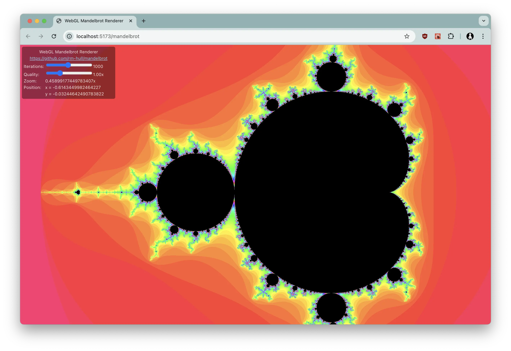

# WebGL Mandelbrot Renderer

A hacky Typescript / React / Vite SPA that compiles a WebGL shader to render the classic Mandlebrot fractal.



Supports (fast) drag and zoom capability, assuming you are using a browser that supports WebGL and have a decent Graphics card.

## Running locally

```
yarn install
yarn dev
```
